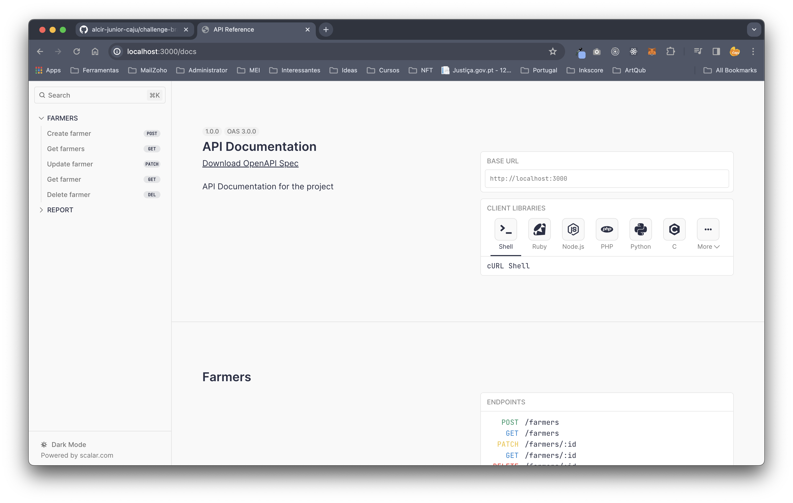
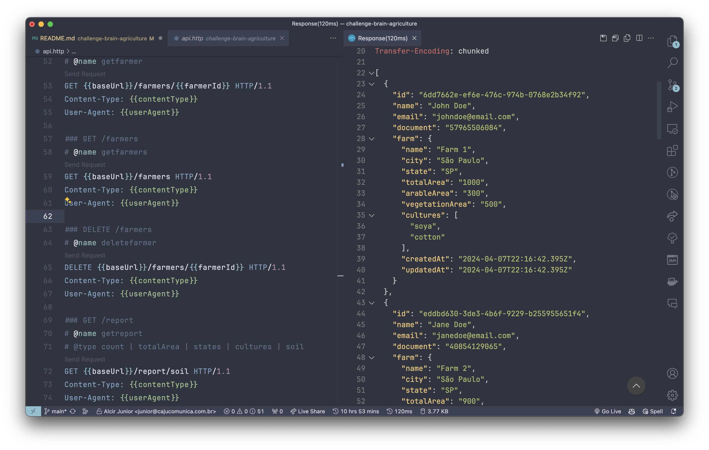
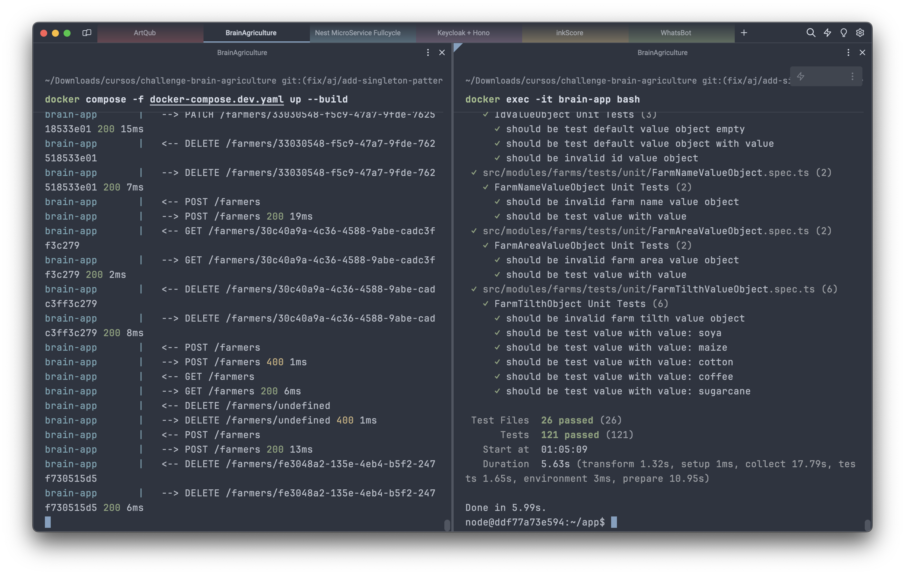

# Challenge Brain Agriculture

    
    

---

## Descrição

Desafio Brain Agriculture com DDD, Clean Architecture e Hono (Um multi-runtime que faz a vez do express) em uma arquitetura monolítica modular.

---

## Visualizar o projeto na IDE:

Para quem quiser visualizar o projeto na IDE clique no teclado a tecla `ponto`, esse recurso do GitHub é bem bacana

## Como usar

- Na raiz do projeto execute o comando `docker compose -f docker-compose.dev.yaml up --build` esse comando irá subir os containers necessários e já irá executar o modo `dev`;
- Com isso é já é possível fazer alguns testes via `REST` temos duas formas:
- Pode se testar via as docs: `http://localhost:3000/docs` veja abaixo a tela de docs:

  

- E pode testar via um plugin do `vscode` o `REST Client` existe um arquivo na raiz do projeto chamado `api.http`;
- Já temos alguns dados pré cadastrados para testar:

  

- Para executar os testes é necessário entrar no `container` do `Node`, para isso, após executar o comando acima do `docker compose` abra um novo terminal e execute o seguinte comando `docker exec -it brain-app bash`;
- Feito isso, dentro do container execute `yarn test:watch` que irá rodar todos os testes da aplicação.

  

